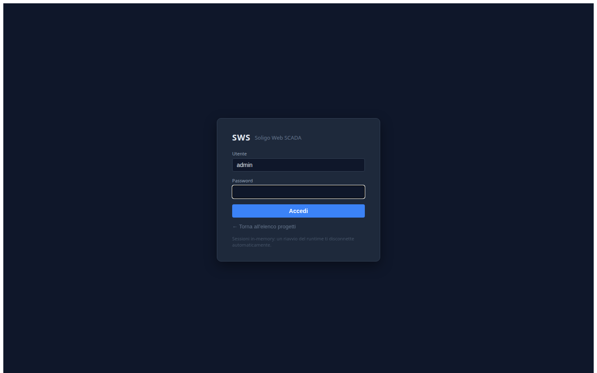

← [Indice](MAIN.md) | [← Panoramica](01_overview.md) | [Successivo → Architettura](03_architecture.md) →

---

# 02 — Quick Start

Questa guida ti porta dall'installazione alla prima schermata operativa in meno di 10 minuti.
Scegli il percorso più adatto alla tua situazione.

---

## Percorso A — Container (più veloce)

Il modo più rapido per vedere SWS in azione senza compilare nulla.

### Prerequisiti

- Docker ≥ 24 oppure Podman ≥ 4 con `podman-compose`
- 512 MB RAM libera
- Porte 8443 e 8444 disponibili

### Avvio

```bash
git clone https://github.com/soligolab/sws.git
cd sws

# Imposta una password admin (obbligatoria, nessun default)
export SWS_ADMIN_PASSWORD=cambiami

docker compose up
```

### Accesso

| URL | Ruolo | Prima visita |
|-----|-------|-------------|
| `https://localhost:8444` | Admin IDE (editor) | Accetta il certificato self-signed |
| `https://localhost:8443` | Viewer operatori | Accetta il certificato self-signed |

> **Certificato self-signed**: il browser mostrerà un avviso di sicurezza. Clicca
> "Continua" (o "Advanced → Proceed"). Il certificato è generato automaticamente e
> rimane lo stesso tra i restart — lo accetti una sola volta per browser.

---

## Percorso B — Sviluppo locale (consigliato per chi sviluppa)

Compila il runtime e avvia editor + runtime in un unico comando.

### Prerequisiti

| Strumento | Versione minima | Installazione |
|-----------|----------------|---------------|
| Rust | 1.75 | `curl --proto '=https' --tlsv1.2 -sSf https://sh.rustup.rs \| sh` |
| Node.js | 20 | [nodejs.org/download](https://nodejs.org/en/download) |
| pnpm | 9 | `npm install -g pnpm` |
| Python | 3.10+ | Normalmente già installato su Linux |

> Su Ubuntu 22.04+: `apt install libssl-dev pkg-config` per la compilazione Rust.

### Primo avvio

```bash
git clone https://github.com/soligolab/sws.git
cd sws

# Installa dipendenze frontend
cd sws-editor && pnpm install && cd ..

# Avvia runtime + editor con un solo comando
./scripts/dev.sh
```

Lo script `dev.sh`:
1. Compila il runtime Rust (solo al primo avvio o dopo modifiche, ~3 min)
2. Genera il certificato TLS self-signed in `.run/config/`
3. Crea un progetto demo in `.run/project/` con due tag (`counter`, `sine`) e un allarme
4. Avvia il runtime sulle porte 8443 e 8444
5. Avvia il server Vite (proxy HTTP sulla porta 5173 → 8444)
6. Stampa gli URL di accesso nel terminale

### Accesso (sviluppo locale)

| URL | Descrizione | Certificato |
|-----|-------------|-------------|
| `http://localhost:5173` | Admin IDE via proxy Vite | Nessuno (HTTP) — consigliato in dev |
| `https://localhost:8443` | Viewer operatori | Self-signed — accetta una volta |
| `https://localhost:8444` | Admin IDE diretto | Self-signed — accetta una volta |

**Raccomandazione**: usa `http://localhost:5173` durante lo sviluppo — non richiede di accettare certificati ed ha l'hot-reload del frontend.

### Accesso da un altro dispositivo in rete

`dev.sh` avvia Vite su `0.0.0.0:5173` e stampa l'IP LAN del server. Dal proprio PC:

```
http://<ip-server>:5173   → Admin IDE (HTTP, nessun cert)
https://<ip-server>:8443  → Viewer operatori (cert da accettare)
```

---

## Primo accesso all'Admin IDE

1. Apri `http://localhost:5173` (o `https://localhost:8444`)
2. Inserisci le credenziali:
   - **Username**: `admin`
   - **Password**: quella impostata in `SWS_ADMIN_PASSWORD` (in dev: `admin`)
3. Clicca **Accedi**



---

## Orientamento nell'interfaccia

### Admin IDE (porta 8444 / 5173)

L'Admin IDE si divide in due modalità principali:

**Modalità Editor** (matita ✏️ nella toolbar):
- Pannello sinistro: palette oggetti (widget da trascinare sul canvas)
- Canvas centrale: sinottico in costruzione
- Pannello destro: proprietà dell'oggetto selezionato
- Toolbar in alto: modalità, salva, undo/redo, zoom, griglia

**Modalità Runtime** (play ▶ nella toolbar):
- Canvas in sola lettura con valori live dal PLC
- Aggiornamento in tempo reale via WebSocket
- Allarmi visibili nell'alarm banner in basso


### Configurazione (tab "Configurazione" nel menu)

Qui si accede a:
- **Runtime**: connessione a runtime remoti, log, package builder
- **Tag**: elenco e modifica tag del progetto
- **Allarmi**: definizione e configurazione allarmi
- **Utenti**: gestione utenti e ruoli
- **Protocolli**: configurazione driver Modbus, OPC-UA, MQTT, ecc.
- **Device**: dashboard multi-runtime con stato e fingerprint
- **GitOps**: commit, push, pull del progetto

### Viewer operatori (porta 8443)

Vista semplificata per il personale di sala controllo:
- Solo lettura (nessun accesso all'editor)
- Autenticazione opzionale (può essere anonimo)
- Alarm banner sempre visibile
- Ottimizzato per schermi touchscreen e pannelli HMI

---

## Progetto demo

`dev.sh` crea automaticamente un progetto di esempio con:

| Tag | Tipo | Valore iniziale | Note |
|-----|------|----------------|------|
| `counter` | Float | 0 | Incrementa ogni secondo via timer interno |
| `sine` | Float | 0 | Onda sinusoidale — da popolare con `demo-sine.py` |

Un allarme `counter_high` scatta quando `counter > 50`.

### Popolare il tag `sine` con dati in movimento

In un secondo terminale:

```bash
./scripts/demo-sine.py
```

Questo script scrive ogni secondo il valore di una sinusoide sul tag `sine`, producendo un segnale animato nel trend.

### Aggiungere un oggetto al sinottico

1. Nell'editor, assicurati di essere in **Modalità Editor** (✏️)
2. Dal pannello sinistro, clicca su **Display → Valore**
3. Trascina il widget sul canvas
4. Nel pannello proprietà a destra, imposta **Tag** → `counter`
5. Clicca **Salva** (o `Ctrl+S`)
6. Passa in **Modalità Runtime** (▶): il contatore si aggiorna in tempo reale

---

## Smoke test da riga di comando

Verifica che il runtime risponda correttamente:

```bash
# Health check
curl -k https://localhost:8443/health
# → {"status":"ok","version":"0.1.0-dev"}

# Tutti i tag (senza autenticazione — porta viewer)
curl -k https://localhost:8443/api/tags

# Scrivi un valore (triggera l'allarme counter_high se > 50)
curl -k -X PUT https://localhost:8443/api/tags/counter \
  -H 'Content-Type: application/json' \
  -d '{"value": 99}'

# Allarmi attivi
curl -k https://localhost:8443/api/alarms

# Storico ultimi 20 valori del tag counter
curl -k 'https://localhost:8443/api/history/counter?limit=20'
```

---

## Arrestare il sistema

In `dev.sh` (modalità `both`): `Ctrl-C` ferma sia il runtime sia Vite.

I dati persistenti sono in `.run/`:
```
.run/
├── config/        # tls.crt + tls.key (persistenti, non rigenerare)
├── project/       # project.yaml con tag e allarmi demo
└── logs/          # runtime.log
```

Per ricominciare da zero:
```bash
rm -rf .run
./scripts/dev.sh
```

---

## Prossimi passi

- [03 — Architettura](03_architecture.md): come funziona internamente SWS
- [04 — Guida all'editor](04_editor_guide.md): come creare sinottici professionali
- [06 — Protocolli](06_protocols.md): collegare SWS a PLC reali

---

← [Indice](MAIN.md) | [← Panoramica](01_overview.md) | [Successivo → Architettura](03_architecture.md) →
