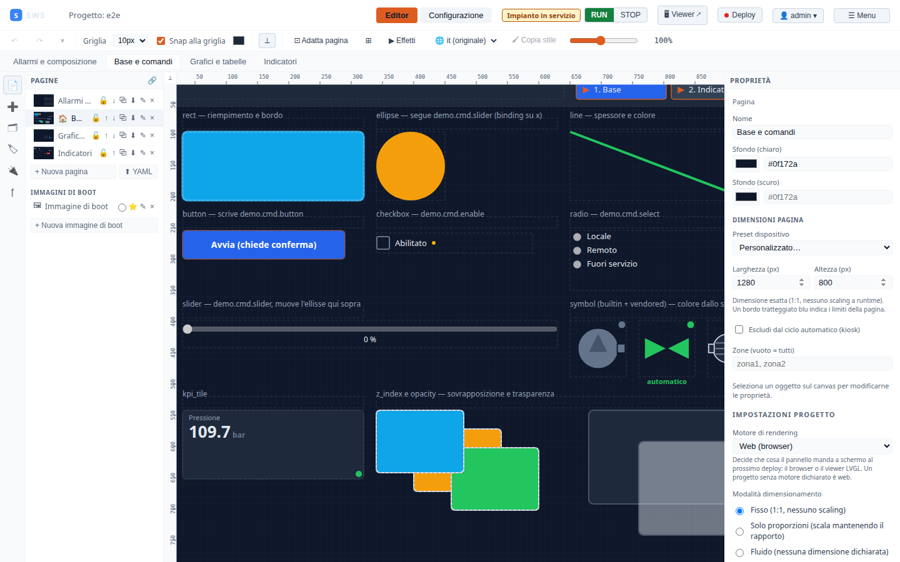
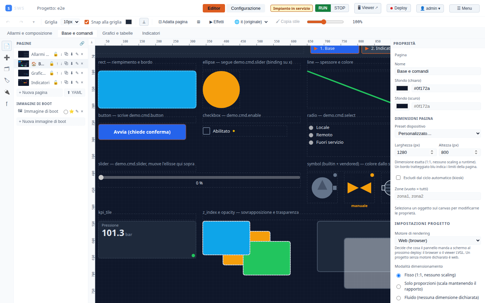

← [Indice](MAIN.md) | [← Architettura](03_architecture.md) | [Successivo → Widget](05_widget_reference.md) →

---

# 04 — Guida all'Editor WYSIWYG

L'editor SWS permette di creare sinottici industriali WYSIWYG direttamente nel browser,
senza installare software. Questa guida descrive l'interfaccia e il workflow di lavoro.

---

## Layout dell'interfaccia



L'interfaccia è divisa in quattro aree:

| Area | Posizione | Funzione |
|------|-----------|---------|
| **Toolbar** | In alto | Modalità, navigazione, azioni progetto |
| **Pannello sinistro** | A sinistra | Palette widget, pagine, oggetti, tag |
| **Canvas** | Al centro | Sinottico in costruzione |
| **Pannello proprietà** | A destra | Configurazione dell'oggetto selezionato |

---

## Toolbar

```
SWS  Project: default  [Editor] [Configurazione]  User: admin  Admin  Griglia: 10px ▼  ● Start  Reboot  ● Deploy  Log  ≡ Menu
```

| Elemento | Funzione |
|----------|---------|
| **Editor / Configurazione** | Alterna tra la vista editor e la configurazione progetto |
| **User: admin Admin** | Badge utente corrente + ruolo (cliccabile per cambio password) |
| **Griglia: 10px** | Snap-to-grid — imposta il passo della griglia (10, 20, 5 px o libero) |
| **RUN / STOP** | Avvia o ferma l'acquisizione dal campo — vedi sotto |
| **Reboot** | Riavvia il runtime (ricarica configurazione) |
| **● Deploy** | Distribuisce la versione locale su un runtime remoto |
| **⚠ (contatore)** | Avvisi del runtime: compare solo se c'è qualcosa che non va |
| **Log** | Apre il pannello log in tempo reale |
| **≡ Menu** | Salva tutto, importa/esporta progetto, simboli personalizzati |

### RUN e STOP: fermare l'acquisizione

Due pulsanti e non un interruttore, di proposito: su un impianto chi preme deve vedere **lo stato
che c'è**, non l'azione che farebbe. Quello acceso dice se l'acquisizione sta girando.

Con l'acquisizione ferma il runtime **resta fermo anche se salvi**. Prima non era così: salvare la
sezione Sorgenti faceva ripartire tutto, perché il salvataggio ricarica le sorgenti — e chi aveva
fermato l'impianto per lavorarci se lo ritrovava in marcia senza aver premuto niente. Adesso
«fermo» è uno stato, e ci vuole un RUN esplicito per uscirne.

### Gli avvisi in testata

Il triangolo con un contatore compare **solo quando c'è qualcosa che non va**, e cliccandolo si apre
un pannello che per ogni voce dice **dove**, **cosa** e **come rimediare**. Serve per i guasti che
altrimenti vivrebbero solo nel log: uno script globale con una schedulazione illeggibile, per
esempio, che non partirà mai e prima non lo diceva nessuno.

Un avviso che si accende anche quando va tutto bene insegna a ignorarlo: per questo qui non c'è
nessun indicatore verde.

---

## Due modalità operative

L'IDE commuta tra due modalità con i pulsanti **Editor** / **Configurazione** nell'header.

### Modalità Editor

La modalità di progettazione del sinottico. Permette:
- Trascinare nuovi widget dalla palette sul canvas
- Selezionare, spostare, ridimensionare oggetti
- Configurare le proprietà nel pannello destro
- Aggiungere, rinominare, riordinare pagine
- Undo/Redo fino a 200 step

### Modalità Configurazione

Tutta la configurazione non grafica del progetto, organizzata in tab: **Variabili** (tag),
Protocolli, Allarmi, Script, Faceplates, Ricette, Notifiche, Datastore, Utenti, Risorse, Backup,
Stato, Device, Runtime. Il tab **Variabili** mostra anche il *valore live* di ogni tag in tempo
reale.

> **Anteprima live del sinottico**: apri il **Viewer operatori** sulla porta 8443. Mostra le
> pagine in sola lettura con i valori aggiornati via WebSocket e l'alarm banner sempre visibile.

---

## Pannello sinistro



Il pannello sinistro è organizzato in sezioni accordion (cliccabili per espandere/collassare):

### PAGINE

Gestione delle pagine del sinottico:
- Doppio click su un nome → rinomina
- Icone: copia, elimina, ↑↓ riordina
- **+ Nuova pagina** — aggiunge una pagina vuota
- **↑ YAML** — importa una pagina da file YAML

### OGGETTI — Palette widget

Widget divisi per categoria:

**FORME** — elementi grafici base:
- Rettangolo, Ellisse, Linea, Testo, Immagine

**CONTROLLI** — interazione operatore:
- Pulsante (scrive un valore al tag), NavButton (navigazione pagina)
- Checkbox, Radio, Slider

**DISPLAY** — visualizzazione valori:
- Gauge (manometro analogico), LED (spia), Progress bar
- Tabella dati, Trend (storico grafico)
- Valore (visualizzatore numerico/testo), Text List (lookup table)
- Bar Chart, Pie/Donut Chart, Sparkline, Alarm Viewer

**SCADA** — simboli industriali:
- Picker simboli (40 in libreria — 29 disegnati e ricolorabili, 11 importati che tengono i propri colori — più i simboli custom caricati)
- Pipe/Tubazione (connettori multi-waypoint)
- Faceplate (componente parametrizzabile)

**LAYOUT** — struttura pagina:
- Grid (griglia con celle configurabili)

### Il limite della pagina

Quando la pagina ha delle dimensioni (modalità **Fisso** o **Solo proporzioni**),
il rettangolo tratteggiato blu è il foglio. Attorno c'è un **tavolo** neutro: il
colore di sfondo che imposti riempie il foglio e si ferma lì, così si vede dove
finisce quello che l'operatore vedrà.

Il bordo del foglio **trattiene ma non imprigiona**. Trascinando un oggetto verso
il bordo si sente una resistenza: l'oggetto si incolla al limite mentre il
cursore lo supera, e si stacca solo se si continua a trascinare con decisione
(una ventina di pixel oltre). Non serve nessun tasto. I due assi sono
indipendenti: un oggetto può scivolare lungo il bordo inferiore mentre esce a
destra.

**Un oggetto portato interamente fuori dal foglio è parcheggiato.** Resta nel
progetto e lo si continua a vedere in editor, grigio e attenuato, ma **non viene
disegnato a runtime**: né nel viewer del browser, né sul pannello, e il
validatore smette di segnalarne i difetti. È il modo di togliere qualcosa dalla
grafica senza cancellarlo — utile per mettere da parte un widget mentre si
riorganizza una pagina, o per tenere pronta una variante.

Basta che l'oggetto tocchi il bordo, anche di un pixel, perché resti attivo: si
spegne solo ciò che è stato portato via del tutto. Le pipe con i capi agganciati
a un altro oggetto fanno eccezione e non si parcheggiano mai — la loro
geometria è dove stanno i capi; per metterne una da parte si staccano prima.

Quando una pagina ha oggetti parcheggiati, il pannello proprietà lo dice col
numero. Vale la pena leggerlo dopo aver **rimpicciolito** una pagina: tutto
quello che resta fuori dalle nuove misure si spegne, e l'avviso è il modo di
accorgersene senza aprire il viewer.

In modalità **Fluida** la pagina non ha dimensioni dichiarate, quindi non ha un
bordo: niente tavolo, niente resistenza, niente parcheggio.

### OGGETTI PAGINA

Lista degli oggetti presenti nella pagina corrente.
Click → seleziona l'oggetto nel canvas.
Icone: elimina, blocca (impedisce selezione accidentale).

### FUNZIONI

Funzioni Python riutilizzabili del progetto.
Crea funzioni che i widget richiamano su `on_press`/`on_release`.

### TAG

Elenco dei tag definiti nel progetto con valore live.

### SORGENTI

Riepilogo delle sorgenti dati (Modbus, OPC-UA, MQTT, ...) con stato connessione.

---

## Operazioni base sul canvas

### Aggiungere un widget

1. Nella palette (sezione **OGGETTI**), clicca il tipo di widget desiderato
2. L'oggetto appare al centro del canvas con dimensioni di default
3. Configuralo nel pannello proprietà a destra

### Selezionare e spostare

- **Click** → seleziona un oggetto
- **Click + trascinamento** → sposta l'oggetto
- **Click su area vuota** → deseleziona tutto
- **Ctrl+A** → seleziona tutti
- **Shift+Click** → selezione multipla

### Ridimensionare

Con un oggetto selezionato, trascina le maniglie bianche agli angoli e ai bordi.
Tieni **Shift** per mantenere le proporzioni.

### Proprietà nel pannello destro

Ogni tipo di widget ha proprietà specifiche (vedi [05 — Widget Reference](05_widget_reference.md)).
Le proprietà comuni a tutti gli oggetti sono:

| Proprietà | Descrizione |
|-----------|-------------|
| **X, Y** | Posizione in pixel dall'angolo in alto a sinistra del canvas |
| **Larghezza, Altezza** | Dimensioni in pixel |
| **Z-index** | Ordine di disegno (valore maggiore = davanti) |
| **Visibile** | On/Off statico |
| **Tag visibilità** | Tag che controlla la visibilità dinamicamente |
| **Rotazione** | Gradi, applicata attorno al centro dell'oggetto |
| **Flip H / V** | Specchio orizzontale/verticale |
| **Opacità** | 0.0 (trasparente) → 1.0 (opaco) |
| **Zona ABAC** | Restrizione accesso (lascia vuoto = nessuna restrizione) |

---

## Binding tag

Il binding è il collegamento tra un widget e un tag PLC.
Quasi tutti i widget hanno un campo **Tag** nel pannello proprietà.

Quando imposti un tag:
1. Il widget mostra il valore live del tag nel Viewer operatori (porta 8443)
2. Il quality dot (•) nell'angolo indica la qualità del dato: verde=Good, rosso=Bad, giallo=Uncertain
3. I widget di controllo (button, slider, checkbox) scrivono sul tag quando l'operatore interagisce

**Formato visualizzazione**: usa il campo **Formato** per specificare la rappresentazione.
Esempio: `{:.1f} bar` → `12.3 bar`, `{:.0%}` → `75%`.

### Universal bindings

Qualsiasi proprietà numerica può essere legata a un tag tramite la sezione **Binding universale**
nel pannello proprietà. Esempio: legare la proprietà `fill` (colore) a un tag booleano
per cambiare colore dinamicamente.

---

## Gestione pagine

### Pagine multiple e navigazione

Un progetto può avere più pagine (sinottici). La navigazione tra pagine avviene:
- **NavButton** — widget pulsante con azione navigazione
- **Grid cell** — ogni cella della griglia può navigare a una pagina

### Auto-rotate (kiosk)

Nella configurazione della pagina (click su area vuota del canvas → pannello proprietà):
- **Escludi dal ciclo automatico** — esclude questa pagina dalla rotazione kiosk
- Utile per pagine di dettaglio o allarme che non devono apparire nella rotazione

### Zone di accesso (ABAC)

Ogni pagina può specificare le **Zone** (es. `zona1, zona2`).
Solo gli utenti con quelle zone nel profilo possono visualizzare la pagina.
Lascia vuoto = nessuna restrizione.

---

## Salvataggio e versioning

### Salva manuale

**≡ Menu → Salva tutto** (o `Ctrl+S`): salva il progetto corrente sul runtime.

### Quando il salvataggio viene rifiutato

Può comparire una banda arancione: **«Il salvataggio è stato rifiutato: qualcun altro ha modificato
il progetto mentre lavoravi, e le sue modifiche non sono state cancellate.»**

Non è un errore: è una protezione. Ogni sezione della Configurazione salva l'elenco **intero** —
tutte le variabili, tutti gli allarmi — quindi due schede aperte sullo stesso progetto, che salvano
una dopo l'altra, si cancellerebbero il lavoro a vicenda senza che nessuno se ne accorga. Il
runtime tiene una versione del file e rifiuta chi parte da una versione vecchia.

Il rimedio è il pulsante **Ricarica** nella banda: rilegge il progetto e riparte da quello che c'è
adesso. **Le modifiche non salvate di quella sezione si perdono**, quindi se hai testo a cui tieni
— un pezzo di codice Python, per esempio — copialo prima di ricaricare.

I casi in cui capita davvero:

- **due schede del browser** aperte sulla stessa Configurazione;
- **un deploy o un pull GitOps** arrivato mentre lavoravi;
- qualcuno che ha modificato i file sul dispositivo.

C'è anche una banda simile, senza rifiuto, che dice «il progetto sul runtime è cambiato: questa
pagina mostra ancora la versione precedente». Quella compare **prima** che tu provi a salvare, e
l'IDE non ricarica da solo di proposito: se avessi del lavoro non salvato, sovrascriverlo senza
chiedere sarebbe peggio che mostrarti dati vecchi.

### ⚠ Aggiorna progetto

Se il progetto è stato salvato da una versione di SWS più vecchia di quella che lo sta servendo,
in testata compare **⚠ Aggiorna progetto**. Il pulsante riscrive i file nel formato corrente,
**senza perdere niente**: le chiavi che questa versione non conosce vengono conservate così come
sono, di proposito, perché «normalizzare il formato» non deve mai voler dire «cancellare ciò che
una versione più nuova ha scritto».

Va premuto una volta sola, e da lì l'avviso sparisce. È l'operazione tipica dopo aver importato un
progetto vecchio o aver aggiornato il runtime di un dispositivo.

### Export / Import

- **≡ Menu → Esporta progetto** → scarica un `.zip` con tutti i YAML
- **≡ Menu → Importa progetto** → carica un `.zip` (sovrascrive il progetto corrente)

### GitOps (versioning avanzato)

Se il progetto è sotto Git (percorso predefinito su device Yocto):
- **Configurazione → Runtime → GitOps**: commit, push, pull, rollback
- Ogni salvataggio non crea automaticamente un commit — devi farlo esplicitamente

Vedi [12 — GitOps](12_gitops.md) per i dettagli.

---

## Undo / Redo

- **Ctrl+Z** — undo (fino a 200 step)
- **Ctrl+Y** o **Ctrl+Shift+Z** — redo
- Il pannello **CRONOLOGIA** in basso a sinistra mostra tutti gli step
- Click su uno step nella cronologia → torna a quello stato

---

## Simboli SVG industriali

Il **Symbol Picker** (nella sezione SCADA → Simbolo) offre:

**22 simboli built-in** per le categorie principali:
- Pompe (centrifuga, peristaltica, vuoto)
- Valvole (on/off, regolatrice, solenoide)
- Motori (elettrico, riduttore)
- Serbatoi (verticale, orizzontale)
- Ventilatori (assiale, centrifugo)
- Scambiatori di calore

**Simboli custom**: carica file SVG da **≡ Menu → Simboli personalizzati**.
I simboli custom vengono salvati nel progetto e condivisi tra tutti i sinottici.

---

## Faceplate (componenti parametrici)

Un faceplate è un gruppo di widget riutilizzabile con parametri sostituibili.

**Esempio**: un faceplate "Pompa" con parametri `tag_prefix` e `label`:
- Contiene un LED (tag: `{tag_prefix}.stato`), un gauge (tag: `{tag_prefix}.portata`), un label (`{label}`)
- Ogni istanza sostituisce `{tag_prefix}` con il valore specifico

Per creare un faceplate: **SCADA → Faceplate → Nuovo**.
Per usarlo: trascina un'istanza dal picker e configura i parametri.

---

## Configurazione avanzata

### Script Python su oggetti

Ogni widget può avere una funzione Python chiamata su `on_press` e `on_release`.
Le funzioni sono definite nella sezione **FUNZIONI** del pannello sinistro.

```python
# Esempio: scrivi un valore e logga
def apri_valvola(tags, api):
    api.write_tag("valvola_1", True)
    api.log("Valvola 1 aperta")
```

### Timer e transizioni

- **Durata transizione (ms)**: anima il cambio di colore/opacità/transform CSS

---

← [Indice](MAIN.md) | [← Architettura](03_architecture.md) | [Successivo → Widget](05_widget_reference.md) →
