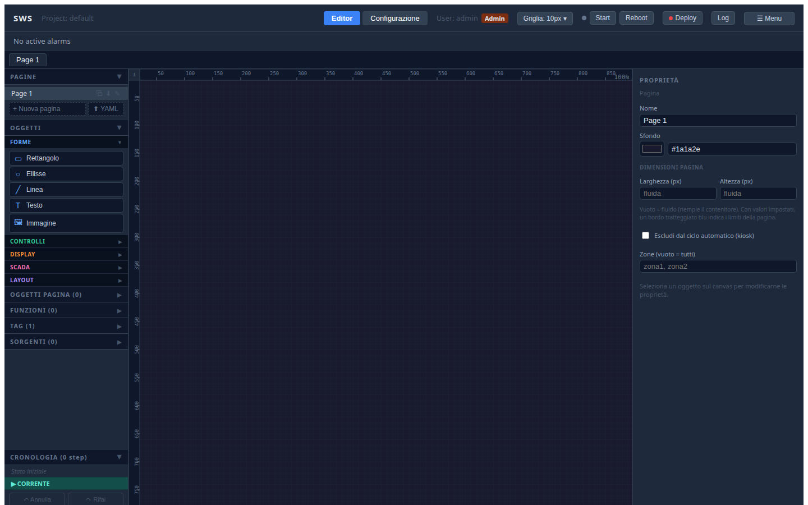

← [Indice](MAIN.md) | [← Editor](04_editor_guide.md) | [Successivo → Protocolli](06_protocols.md) →

---

# 05 — Riferimento Widget

Elenco completo di tutti i widget disponibili nella palette dell'editor, con descrizione,
proprietà configurabili e comportamento in runtime.

Le proprietà **comuni a tutti gli oggetti** sono descritte in [04 — Guida all'Editor](04_editor_guide.md#binding-tag).

---

## FORME

### Rettangolo (`rect`)

Forma geometrica base con bordo e riempimento.

| Proprietà | Descrizione |
|-----------|-------------|
| `fill` | Colore riempimento |
| `stroke` | Colore bordo |
| `stroke_width` | Spessore bordo (px) |
| `tag` | Tag che controlla il colore di riempimento (valore numerico mappato) |

---

### Ellisse (`ellipse`)

Cerchio o ovale. Stesse proprietà del rettangolo.

---

### Linea (`line`)

Segmento con punto iniziale e finale separati.

| Proprietà | Descrizione |
|-----------|-------------|
| `stroke` | Colore |
| `stroke_width` | Spessore (px) |
| `x2, y2` | Coordinate punto finale |

---

### Testo (`text`)

Etichetta statica o dinamica.

| Proprietà | Descrizione |
|-----------|-------------|
| `text` | Testo statico |
| `tag` | Tag il cui valore sovrascrive il testo |
| `format` | Formato Python (`{:.1f} bar`, `{value}`, ecc.) |
| `font_size` | Dimensione font (px) |
| `font_family` | Famiglia font |
| `font_weight` | Peso: `normal`, `bold`, 100-900 |
| `font_style` | `normal`, `italic` |
| `text_anchor` | Allineamento: `start`, `middle`, `end` |
| `color` | Colore testo |

---

### Immagine (`image`)

Immagine statica (PNG, JPG, SVG) caricata come risorsa del progetto.

| Proprietà | Descrizione |
|-----------|-------------|
| `src` | URL dell'immagine (relativo alle risorse del progetto) |

---

## CONTROLLI

### Pulsante (`button`)

Elemento interattivo che scrive un valore al tag al click.

| Proprietà | Descrizione |
|-----------|-------------|
| `label` | Testo del pulsante |
| `tag` | Tag da scrivere |
| `write_value` | Valore da scrivere (`true`, `false`, numero, stringa) |
| `on_press_fn` | Funzione Python da chiamare al click |
| `button_action` | Azione built-in: `login`, `logout`, `navigate` |

**Azioni built-in**:
- `login` — apre il form di autenticazione sovrapposto al sinottico
- `logout` — disconnette l'utente
- `navigate` — naviga a un URL (altra pagina o sinottico esterno)

---

### NavButton (`navbutton`)

Pulsante di navigazione tra pagine del sinottico.

| Proprietà | Descrizione |
|-----------|-------------|
| `label` | Testo del pulsante |
| `target_page` | ID della pagina di destinazione |

---

### Checkbox (`checkbox`)

Toggle binario che scrive un valore al tag.

| Proprietà | Descrizione |
|-----------|-------------|
| `tag` | Tag da scrivere |
| `checked_value` | Valore scritto quando selezionato (default `true`) |
| `unchecked_value` | Valore scritto quando deselezionato (default `false`) |
| `label` | Etichetta a fianco |

---

### Radio (`radio`)

Selezione singola tra opzioni predefinite.

| Proprietà | Descrizione |
|-----------|-------------|
| `tag` | Tag da scrivere |
| `options` | Lista `{label, value}` delle opzioni |

---

### Slider (`slider`)

Cursore analogico per impostare valori numerici.

| Proprietà | Descrizione |
|-----------|-------------|
| `tag` | Tag da leggere e scrivere |
| `min, max` | Limiti del range |
| `step` | Passo minimo |
| `orientation` | `horizontal` (default) o `vertical` |
| `show_value` | Mostra il valore corrente sopra il cursore |

---

## DISPLAY

### Gauge (`gauge`)

Manometro analogico a semicerchio.

| Proprietà | Descrizione |
|-----------|-------------|
| `tag` | Tag da visualizzare |
| `min, max` | Range |
| `unit` | Unità di misura visualizzata |
| `warn_low/high` | Soglie warning (giallo) |
| `alarm_low/high` | Soglie allarme (rosso) |
| `format` | Formato valore centrale |

---

### LED (`led`)

Spia di stato binaria (accesa/spenta).

| Proprietà | Descrizione |
|-----------|-------------|
| `tag` | Tag che controlla lo stato |
| `on_value` | Valore del tag che indica "acceso" (default `true`) |
| `on_color` | Colore stato acceso (default verde) |
| `off_color` | Colore stato spento (default grigio) |

---

### Progress Bar (`progress_bar`)

Barra di avanzamento proporzionale.

| Proprietà | Descrizione |
|-----------|-------------|
| `tag` | Tag da visualizzare |
| `min, max` | Range completo |
| `fill` | Colore barra |
| `orientation` | `horizontal` o `vertical` |
| `show_value` | Mostra percentuale |
| `warn_high, alarm_high` | Soglie colore |

---

### Tabella (`table`)

Griglia di valori multi-tag.

| Proprietà | Descrizione |
|-----------|-------------|
| `table_rows` | Array `{label, tag, format}` — una riga per tag |

Ogni riga mostra l'etichetta nella colonna sinistra e il valore live nella destra.

---

### Trend (`trend`)

Grafico storico con Canvas 2D, pan e zoom.

| Proprietà | Descrizione |
|-----------|-------------|
| `tag` | Tag primario |
| `extra_tags` | Tag aggiuntivi sovrapposti (multi-serie) |
| `window_s` | Finestra temporale in secondi |
| `y_min, y_max` | Range Y (auto se omessi) |
| `line_color` | Colore linea primaria |
| `opcua_backfill` | Backfill dati storici OPC-UA al mount |

Il trend supporta pan (trascinamento) e zoom (rotella mouse). Cliccando sul titolo si apre
la vista espansa a schermo intero.

---

### Valore / Value Display

Visualizza il valore di un tag come testo formattato.

| Proprietà | Descrizione |
|-----------|-------------|
| `tag` | Tag da mostrare |
| `format` | Formato: `{:.2f}`, `{:.0f} rpm`, `{value}` |
| `color` | Colore testo |
| `font_size` | Dimensione font |

---

### Text List (`text_list`)

Mappa valori numerici a etichette testuali (lookup table).
Utile per stati macchina: `0 → "Fermo"`, `1 → "Avvio"`, `2 → "In marcia"`.

| Proprietà | Descrizione |
|-----------|-------------|
| `tag` | Tag da leggere |
| `text_list_entries` | Array `{value, label, color?}` |
| `text_list_default` | Testo mostrato se il valore non è nella lista |
| `text_list_default_color` | Colore testo di default |

**Esempio entries**:
```yaml
- value: 0
  label: "Fermo"
  color: "#94a3b8"
- value: 1
  label: "Avvio"
  color: "#fbbf24"
- value: 2
  label: "In marcia"
  color: "#22c55e"
- value: 99
  label: "Errore"
  color: "#ef4444"
```

---

### Bar Chart (`bar_chart`)

Istogramma SVG multi-serie con linee di soglia.



| Proprietà | Descrizione |
|-----------|-------------|
| `bar_series` | Array `{tag, label, color, min?, max?}` — una barra per serie |
| `bar_orientation` | `vertical` (default) o `horizontal` |
| `bar_show_values` | Mostra il valore sopra ogni barra |
| `bar_show_labels` | Mostra le etichette sotto ogni barra |
| `bar_show_thresholds` | Mostra linee warn/alarm dal tag principale |
| `bar_gap` | Spaziatura tra barre (px) |
| `bar_y_label` | Etichetta asse Y |
| `warn_high, alarm_high` | Soglie visualizzate come linee orizzontali |

Se `min`/`max` non sono impostati per una serie, il range viene calcolato su tutti i valori correnti.

---

### Pie / Donut Chart (`pie_chart`)

Grafico a torta o ciambella con valori live da tag multipli.

| Proprietà | Descrizione |
|-----------|-------------|
| `pie_slices` | Array `{tag, label, color}` — una fetta per tag |
| `pie_mode` | `pie` (torta) o `donut` (ciambella) |
| `pie_inner_ratio` | Raggio interno della ciambella (0.0-0.9; default 0.55) |
| `pie_show_labels` | Mostra percentuali sulle fette |
| `pie_show_legend` | Mostra legenda laterale |
| `pie_center_text` | Testo statico al centro (solo donut) |
| `pie_center_tag` | Tag il cui valore appare al centro |
| `pie_center_format` | Formato del valore centrale |

**Nota**: se una sola fetta ha valore > 0 (100%), viene disegnato un cerchio pieno
invece di un arco degenere.

---

### Sparkline (`sparkline`)

Mini-trend senza assi per embedding in griglie o dashboard compatte.
Accumula campioni in una finestra mobile e li visualizza come polilinea.

| Proprietà | Descrizione |
|-----------|-------------|
| `tag` | Tag da monitorare |
| `spark_window_s` | Finestra temporale in secondi (default 60) |
| `spark_color` | Colore linea |
| `spark_fill` | Area sotto la curva riempita |
| `spark_fill_opacity` | Opacità riempimento (0.0-1.0) |
| `spark_show_last` | Mostra il valore corrente in angolo |
| `spark_stroke_width` | Spessore linea (px) |

---

### Alarm Viewer (`alarm_viewer`)

Visualizzatore allarmi attivi embedded nel sinottico.
Due modalità: lista scrollabile o banner ticker orizzontale.

| Proprietà | Descrizione |
|-----------|-------------|
| `alarm_viewer_mode` | `list` (tabella) o `banner` (ticker animato) |
| `alarm_viewer_max_rows` | Max righe mostrate in modalità lista |
| `alarm_viewer_id_prefix` | Filtra per prefisso ID allarme (es. `"pompa_"`) |
| `alarm_viewer_severities` | Filtra severità: `["Info","Warning","Critical"]` |
| `alarm_viewer_show_ack` | Pulsante ACK inline (richiede ruolo Operator+) |
| `alarm_viewer_show_ts` | Colonna timestamp |
| `alarm_viewer_show_empty` | Messaggio "Nessun allarme" quando lista vuota |
| `alarm_viewer_bg_color` | Colore sfondo widget |

---

## SCADA

### Simbolo (`symbol`)

Simbolo SVG industriale dalla libreria built-in o custom.

| Proprietà | Descrizione |
|-----------|-------------|
| `symbol_id` | ID simbolo dalla libreria |
| `state_tag` | Tag che controlla lo stato (truthy = acceso/in marcia) |
| `alarm_tag` | Tag che forza lo stato di allarme |
| `state_off_color` | Colore stato spento/fermo |
| `state_on_color` | Colore stato acceso/in marcia |
| `state_alarm_color` | Colore stato allarme |

**Simboli built-in disponibili**:

| Categoria | Simboli |
|-----------|---------|
| Pompe | Centrifuga, Peristaltica, Vuoto |
| Valvole | On/Off, Regolatrice, Solenoide |
| Motori | Elettrico, Riduttore |
| Serbatoi | Verticale, Orizzontale |
| Ventilatori | Assiale, Centrifugo |
| Scambiatori | Tubolare, A piastre |

---

### Pipe / Tubazione (`pipe`)

Connettore multi-waypoint con animazione di livello fluido.
Ideale per diagrammi P&ID.

| Proprietà | Descrizione |
|-----------|-------------|
| `points` | Array `{x, y}` — waypoint del percorso (min 2) |
| `routing` | `straight`, `orthogonal`, `diagonal`, `bezier` |
| `pipe_style` | `flat`, `tube` (3D), `wire` (linea fine) |
| `pipe_gradient` | Abilita gradiente 3D (auto per `tube`) |
| `stroke` | Colore base della tubazione |
| `stroke_width` | Diametro esterno |
| `fill_level` | Livello fluido statico (0.0-1.0) |
| `fill_level_tag` | Tag che controlla il livello dinamicamente |
| `fill_level_scale` | Scala tag: `0-1` o `0-100` |
| `fill_color` | Colore fluido |
| `fill_direction` | `start-to-end` o `end-to-start` |
| `start_marker / end_marker` | `none`, `arrow`, `dot`, `flange` |
| `pipe_label_tag` | Tag il cui valore appare come etichetta |
| `stroke_dasharray` | Tratteggio SVG (es. `"6,3"`) |
| `from_obj_id / to_obj_id` | Aggancia la pipe a un altro oggetto |
| `from_port / to_port` | Porta di ancoraggio: `top`, `bottom`, `left`, `right`, `center` |

---

### Faceplate (`faceplate`)

Istanza di un faceplate parametrico definito nel progetto.

| Proprietà | Descrizione |
|-----------|-------------|
| `faceplate_id` | ID del FaceplateDef da istanziare |
| `faceplate_params` | Mappa `{parametro: valore}` sostituita nel template |

---

## LAYOUT

### Grid (`grid`)

Griglia con celle configurabili individualmente.
Ogni cella può contenere un oggetto, un'immagine di sfondo, una funzione Python,
e può essere suddivisa ricorsivamente.

| Proprietà | Descrizione |
|-----------|-------------|
| `grid_rows / grid_cols` | Dimensioni griglia |
| `col_widths` | Array larghezze colonne (px) |
| `row_heights` | Array altezze righe (px) |
| `grid_cells` | Array `GridCell` — configurazione per ogni cella |
| `grid_show_borders` | Mostra bordi celle |
| `grid_border_color` | Colore bordi |

**Ogni GridCell può avere**:
- `bg_color` — colore sfondo cella
- `bg_image` — immagine sfondo cella
- `visible_tag` — tag che controlla visibilità
- `on_press_fn` — funzione Python al click sulla cella
- `child` — un oggetto SVG al centro della cella
- `sub` — suddivisione della cella in due slot (ricorsivo)

---

## Proprietà cross-cutting

Queste proprietà sono disponibili su quasi tutti gli oggetti:

### Quality dot

Un piccolo indicatore di qualità nell'angolo superiore destro di ogni widget che mostra un tag:

| Colore | Significato |
|--------|-------------|
| Verde (●) | `Good` — dato valido |
| Rosso (●) | `Bad` — errore comunicazione, tag non disponibile |
| Giallo (●) | `Uncertain` — dato di qualità incerta |

| Proprietà | Descrizione |
|-----------|-------------|
| `quality_dot` | Abilita/disabilita il dot (default: `true`) |
| `quality_dot_good_color` | Override colore Good |
| `quality_dot_bad_color` | Override colore Bad |
| `quality_dot_uncertain_color` | Override colore Uncertain |

### Transizione CSS

Anima il cambio di `fill`, `stroke`, `opacity`, `transform`:

| Proprietà | Descrizione |
|-----------|-------------|
| `transition_duration_ms` | Durata animazione in ms (0 = nessuna) |

### Bindings universali

Permette di legare qualsiasi proprietà numerica a un tag:

```yaml
bindings:
  fill: "tag_colore"        # fill cambia col valore del tag
  opacity: "tag_opacita"    # opacità dinamica
  rotation: "tag_angolo"    # rotazione dinamica
```

---

← [Indice](MAIN.md) | [← Editor](04_editor_guide.md) | [Successivo → Protocolli](06_protocols.md) →
