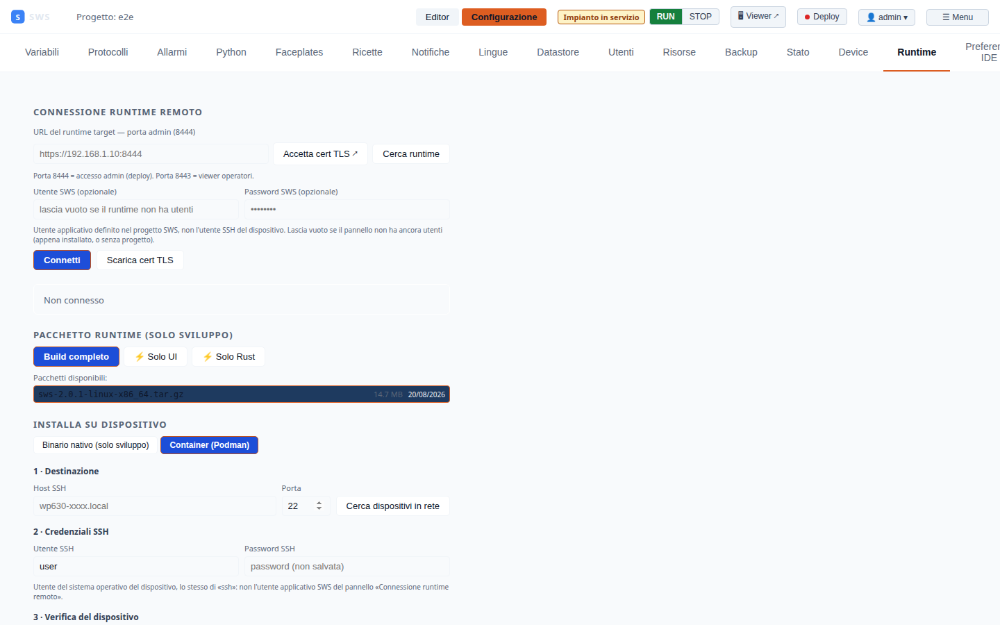

← [Indice](MAIN.md) | [← Deployment](10_deployment.md) | [Successivo → GitOps](12_gitops.md) →

---

# 11 — Package Builder e SSH Deploy

L'IDE include uno strumento integrato per costruire il pacchetto runtime e
distribuirlo direttamente su device remoti via SSH — senza uscire dal browser.

Disponibile in: **Configurazione → Runtime** (connesso come Admin).

---

## Sezione "Pacchetto Runtime"



Questa sezione appare nella tab **Runtime** della Configurazione
quando l'IDE è connesso a un runtime che ha `scripts/package.sh` disponibile.

### Prerequisiti

Il runtime deve essere avviato dalla **root del repository** (non da un device già deployato):

```bash
cd /path/to/sws
./scripts/start_runtime.sh
```

Se il runtime è avviato da un device Yocto o da `/opt/sws/`, il package builder
non è disponibile (il messaggio lo indica).

---

## Build del tarball

### Dalla UI

1. **Configurazione → Runtime** (assicurati di essere connesso)
2. Nella sezione **Pacchetto Runtime**, scegli le opzioni:
   - ✅ **Salta compilazione Rust** (usa binario già compilato)
   - ✅ **Salta build SPA** (usa frontend già compilato)
3. Click **🔨 Build pacchetto**
4. Il log di build appare in tempo reale (streaming chunked)
5. Al termine: `DONE` → il tarball è in `dist/`

### Dalla riga di comando

```bash
./scripts/package.sh                    # build completo (~5 min)
./scripts/package.sh --no-rust          # salta cargo build
./scripts/package.sh --no-spa           # salta pnpm build
./scripts/package.sh --no-rust --no-spa # solo impacchetta
```

Output: `dist/sws-2026.7.0-linux-x86_64.tar.gz`

---

## Lista pacchetti disponibili

Dopo la build, la sezione mostra i tarball presenti in `dist/`:

| Colonna | Descrizione |
|---------|-------------|
| Nome | `sws-<versione>-linux-<arch>.tar.gz` |
| Dimensione | In MB |
| Data | Timestamp di creazione |

Click su un tarball per selezionarlo come target del deploy.

---

## Deploy SSH su device

### Dalla UI

Con un tarball selezionato, compila il form **Installa su dispositivo**:

| Campo | Descrizione | Default |
|-------|-------------|---------|
| **Host / IP** | Indirizzo del device target | — |
| **Porta SSH** | Porta SSH del device | `22` |
| **Utente** | Username SSH | — |
| **Password** | Password SSH (via sshpass) | — |
| **Directory remota** | Percorso estrazione tarball | `/tmp/sws-deploy` |

Click **📦 Deploy su device**.

### Passi automatici del deploy

Il sistema esegue in sequenza, con log in streaming:

```
==> SCP: dist/sws-2026.7.0-linux-x86_64.tar.gz → user@192.168.1.10:/tmp/sws-deploy/
==> SCP completato
==> Estrazione tarball...
==> Installazione (install.sh)...
==> Health check...
==> Health check: OK
DONE
```

1. **SCP upload** — copia il tarball nel `remote_dir` del device
2. **Estrazione** — `mkdir -p <dir> && tar xzf <tarball> -C <dir>`
3. **Install** — `chmod +x install.sh && sudo ./install.sh`
4. **Health check** — `sleep 3 && curl -sk https://localhost:8443/health`

### Sicurezza

- Il percorso remoto è validato: deve essere assoluto, senza `..`, solo caratteri `[a-zA-Z0-9\-_./]`
- Il nome del tarball è validato: solo basename, deve terminare con `.tar.gz`
- Il tarball deve esistere nella directory `dist/` del repo (symlink escape prevenuto con `canonicalize()`)
- La password SSH è passata via `sshpass` — mai interpolata nella shell

### Nota su sshpass

`sshpass` deve essere installato sul sistema che esegue il runtime:

```bash
# Ubuntu/Debian
sudo apt install sshpass

# Fedora/RHEL
sudo dnf install sshpass
```

Se `sshpass` non è disponibile, il deploy usa SSH senza password
(richiede chiave SSH pre-configurata sul device).

---

## Deploy container (Podman)

Alternativa al binario nativo: installa il runtime come **container Podman
rootless**, gestito da systemd tramite una unit **quadlet** — nessun `sudo`
richiesto sul device, a differenza del binario nativo.

### Dalla UI

Nel form **Installa su dispositivo**, scegli **Container (Podman)** invece di
**Binario nativo**. Compaiono campi aggiuntivi:

| Campo | Descrizione | Default |
|-------|-------------|---------|
| **Sorgente immagine** | Registry (scarica sul device) o Archivio locale (SCP di ~59 MB) | Registry |
| **Riferimento immagine** | Solo con Registry — vuoto = ultima immagine per l'architettura del device | — |
| **Percorso dati sul device** | Directory per progetti/config/log | `/data/user/sws` |
| **Installazione pulita** | Azzera i dati esistenti prima di installare (richiede conferma) | Disattivato |

I campi Host/Porta/Utente/Password/Directory remota sono gli stessi del
binario nativo, sopra.

Click **🐳 Installa / Aggiorna container**. Il servizio si avvia automaticamente
al boot (via `loginctl enable-linger` + `[Install] WantedBy=default.target`
nella unit quadlet) — un container rootless non riparte da solo dopo un
reboot senza questi due elementi.

### Gestione container

Sotto il pannello di installazione, la sezione **Gestione container** agisce
su un container **già installato** (su questa stessa macchina o su un
device remoto, indipendentemente da quando/come è stato installato):

| Ambito | Come funziona |
|--------|---------------|
| **Locale** (default) | Nessun SSH — comandi diretti sul host che esegue l'IDE. Pensato per il caso più comune: un container installato per test sulla stessa macchina, che collide con `start_runtime.sh` sulle stesse porte. |
| **Remoto** | Riusa i campi SSH del pannello di installazione sopra. |

Azioni disponibili:

- **Stato** — riepilogo `systemctl status`, avvio automatico al boot, linger,
  stato del container.
- **Avvia / Ferma / Riavvia** — `systemctl --user start/stop/restart`.
- **Abilita / Disabilita avvio al boot** — commenta/scommenta `WantedBy=` nella
  unit quadlet e ricarica systemd. *Non* usa `systemctl enable/disable`: per
  una unit generata da quadlet è un no-op (rigenerata da zero a ogni
  `daemon-reload`/boot dalla sezione `[Install]` del file `.container`, non da
  un unit file persistente). Non tocca lo stato corrente: disabilitare non
  ferma un container in esecuzione.
- **Policy di restart** — riscrive `Restart=` nella unit (Sempre / Solo su
  errore / Mai) e ricarica systemd. Cambia solo cosa succede al *prossimo*
  stop/crash, non riavvia il servizio.
- **Disinstalla** (zona pericolosa) — rimuove servizio, unit quadlet e
  container. Con **"Cancella anche i dati"** (richiede conferma), cancella
  anche la directory dati — altrimenti resta sul disco.

### Comandi equivalenti da riga di comando

```bash
# Installazione
./deploy/container/install-container.sh --pull

# Gestione
systemctl --user status  sws-runtime
systemctl --user restart sws-runtime
journalctl --user -u sws-runtime -f

# Disinstallazione
./deploy/container/install-container.sh --uninstall            # dati conservati
./deploy/container/install-container.sh --uninstall --purge    # dati compresi
```

---

## Alternativa: deploy manuale

Se preferisci non usare la UI, il deploy manuale è sempre disponibile:

```bash
# 1. Build
./scripts/package.sh

# 2. SCP
scp dist/sws-2026.7.0-linux-x86_64.tar.gz utente@device:/tmp/

# 3. SSH + install
ssh utente@device "
  cd /tmp
  tar xzf sws-2026.7.0-linux-x86_64.tar.gz
  cd sws-2026.7.0-linux-x86_64
  sudo ./install.sh
"

# 4. Health check
curl -k https://device:8443/health
```

---

← [Indice](MAIN.md) | [← Deployment](10_deployment.md) | [Successivo → GitOps](12_gitops.md) →
