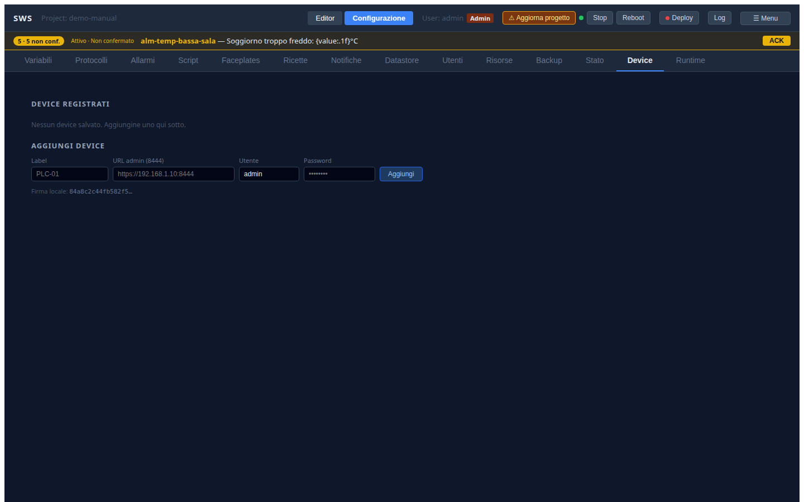

← [Indice](MAIN.md) | [← Package Builder](11_packaging_deploy.md) | [Successivo → API](13_api_reference.md) →

---

# 12 — GitOps

SWS tratta i progetti come repository Git. L'IDE permette di fare commit, push,
pull e rollback direttamente dal browser, senza usare la riga di comando.

Disponibile in: **Configurazione → Runtime → GitOps** (connesso come Admin/Supervisor).

---

## Concetti base

Il formato progetto SWS (directory di file YAML) è naturalmente adatto a Git:
- Ogni modifica al sinottico è una modifica a un file YAML
- Il diff è human-readable
- Il merge tra branch è possibile con strumenti Git standard
- Il rollback è un `git checkout` su commit precedente

---

## Prerequisiti

Il progetto aperto sul runtime deve essere in una directory Git:

```bash
# Verifica
git -C /var/lib/sws/default status
```

In ambiente dev (`./scripts/start_runtime.sh`), i progetti sotto `.run/projects/` NON sono
repository Git — il GitOps è disponibile solo su device con progetti versionati.

---

## Stato Git (GitOps Panel)

Il pannello **GitOps** in **Configurazione → Runtime** mostra:

| Campo | Descrizione |
|-------|-------------|
| **Branch** | Branch corrente |
| **Commit** | Hash SHA del commit HEAD |
| **Autore** | Autore dell'ultimo commit |
| **Messaggio** | Messaggio dell'ultimo commit |
| **Data** | Timestamp commit |
| **Remote** | URL remote (se configurato) |
| **Stato** | `clean` o `modifiche non committate` |
| **Commit non inviati** | Numero di commit davanti al remote |

---

## Commit

### Dalla UI

1. **Configurazione → Runtime → GitOps → Commit**
2. Scrivi il messaggio di commit nel campo testo
3. Click **💾 Commit**

Il sistema esegue `git add -A && git commit -m "<messaggio>"`.

**Ruolo richiesto**: Supervisor o Admin.

### Note sicurezza

Il messaggio di commit viene passato come argomento discreto all'eseguibile git
(non interpolato nella shell) — nessun rischio di command injection.

---

## Push

### Dalla UI

Click **↑ Push (N)** dove N è il numero di commit non ancora inviati al remote.

Il sistema esegue `git push origin <branch>`.

**Ruolo richiesto**: Admin.

**Prerequisiti**:
- Il repository deve avere un remote configurato (`git remote -v`)
- Il runtime deve avere accesso SSH o HTTPS al remote (chiave SSH o token)

---

## Pull (aggiornamento da remote)

### Dalla UI

Click **⬇ Pull** per scaricare gli aggiornamenti dal remote.

Il sistema esegue `git pull --rebase origin <branch>`.

**Attenzione**: se ci sono modifiche locali non committate, il pull può fallire.
Fai sempre il commit prima del pull.

---

## Rollback

### Dalla UI

**Configurazione → Runtime → GitOps → Rollback** mostra gli ultimi N commit.
Click su un commit per tornare a quello stato.

Il sistema esegue `git checkout <sha> -- .` per ripristinare i file
senza cambiare il branch HEAD (permette di tornare avanti se necessario).

Per rendere permanente il rollback:
```bash
git revert <sha>  # oppure git reset --hard <sha>
```

---

## Project Fingerprint

Il **fingerprint** è un hash SHA256 deterministico del progetto corrente:
calcolato su `project.yaml` + tutti i file `synoptics/*.yaml` ordinati per nome.

Serve per verificare che il progetto su un device sia identico alla versione di riferimento.

### Dalla UI

**Configurazione → Device** — ogni card device mostra:
- ✅ **Firma OK** — identica al progetto locale
- ⚠️ **Firma diversa** — il device ha una versione diversa del progetto
- ❌ **Non raggiungibile** — device offline

### Via API

```bash
TOKEN=$(curl -sk -X POST https://localhost:8444/api/auth/login \
  -H 'Content-Type: application/json' \
  -d '{"username":"admin","password":"admin"}' | jq -r .token)

curl -sk -H "Authorization: Bearer $TOKEN" \
  https://localhost:8444/api/project/fingerprint
```

**Risposta**:
```json
{
  "sha256": "a3f4c2d1e8b7...",
  "computed_at_ms": 1735600000000
}
```

---

## Device Dashboard

**Configurazione → Device** mostra tutti i runtime SWS salvati:



Per ogni device:
- **Stato**: Online (verde) / Offline (rosso)
- **Fingerprint**: identico / diverso / non disponibile
- **URL**: link diretto all'admin IDE
- **Versione**: versione del runtime
- **Pulsanti**: Connetti, Aggiorna, Rimuovi

### Aggiungere un device

1. Click **+ Aggiungi device**
2. Inserisci label, URL (`https://<ip>:8444`), username, password
3. Click **Salva** — il device viene aggiunto alla lista e pingato

I device sono salvati in localStorage del browser (non nel progetto).

---

## Flusso GitOps tipico

```
[Ingegnere - local dev]
  ./scripts/start_editor.sh
  → Modifica sinottici
  → GitOps: Commit "feat: aggiunta pompa P3"
  → GitOps: Push

[Admin - device remoto]
  Configurazione → Runtime → GitOps: Pull
  → Il device scarica le modifiche
  → Fingerprint si aggiorna automaticamente

[Verifica multi-device]
  Configurazione → Device
  → Tutti i device mostrano ✅ Firma OK
```

---

← [Indice](MAIN.md) | [← Package Builder](11_packaging_deploy.md) | [Successivo → API](13_api_reference.md) →
